#文献阅读总结

阅读论文：Pilman, Markus, et al. "ParTime: Parallel Temporal Aggregation." Proceedings of the 2016 International Conference on Management of Data. ACM, 2016.

博客地址：https://github.com/MyXOF/Paper-Review-ParTime

##Temporal Database的由来

传统数据库主要记录当前表的一个最新状态，无法直接记录历史的状态。然而在实际的使用场景中，需要看到某个记录在过去的一段时间内的状态。比如在保险行业，需要看客户投保的时间在哪个范围之内，这就需要根据不同的时间范围进行查询。

时序数据库的出现主要是为了解决数据库系统中同一份数据多版本的问题。

Temporal database中常用到的一些概念：

* Valid Time：有效时间，在真实世界中实际发生的时间
* Transaction Time：事务时间，一个数据库操作发生的时间

如果在传统的关系型数据库要解决上述问题，看上去增加两列即可，即Start-Valid-Time 和 End-Valid-Time，但问题在于这两个字段和其他字段的地位是等同的，相当于在建表的时候显示的增加了两个字段。

那么问题有很多。关于如何建立主键的问题(如图1)，如果光把原来的主键加上新的两个时间列作为主键，那会存在时间交叠的问题。因此需要能支持不交叠的主键设置。

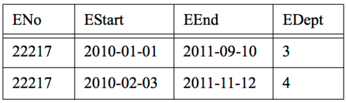

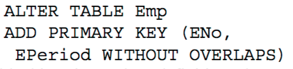

图1 主键约束

外键约束同样存在问题(如图2)，22218编号在第二行对应EDept是4，但是第二张表里面4对应的有效期是从2011-6-1开始的，和原来的2011-2-3不符，因此直接加上外键约束也有问题，需要时序数据库做额外的支持

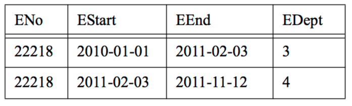

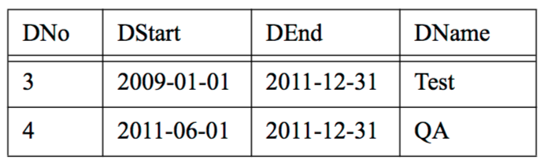

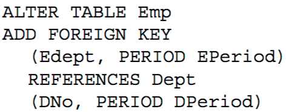

图2 外键约束

除了创建数据库表的时候存在一系列问题，对于表操作也会出现各种各样的问题

* 对于插入操作和删除操作，看上去没有问题
* 更新操作，稍微麻烦一些，需要按时间范围查找到要更新的项
* 查询操作就有麻烦了，问题之一就是怎么看最新的结果，是不是要全部取出来在进行排序，才能看到最新的

可以看到如果在传统的数据库上要实现数据多版本的功能，需要数据库的使用者自己进行大量的维护，十分麻烦。

基于上面的问题，才有了真正的Temporal Database，除了解决多版本的问题，时序数据库还未用户提供丰富的增删改查的功能，具体实现思路为：表面上还是在建表的时候增加了起始时间两列，不同之处在于需要指定这两个字段作为时间间隔告诉系统。

##SQL 2011标准

在SQL 2011标准中，没有将时间戳作为一种新的数据类型需要在建表的时候声明（兼容性问题），而是增加了period的定义，作为表结构的metadata，指定两列记录起始变化时间，采用[xxx,xxx)左闭右开的取值方。原文如下：

SQL:2011 adds period definitions as metadata to tables. A period definition is a named table component, identifying a pair of columns that capture the period start and the period end time.

##现有系统实现

现在很多商业数据库都支持Temporal特性，这里列举MS SQL Server 2016和IBM DB2 10的例子，在建表的时候都需要显式的声明哪个字段用于记录数据的版本。

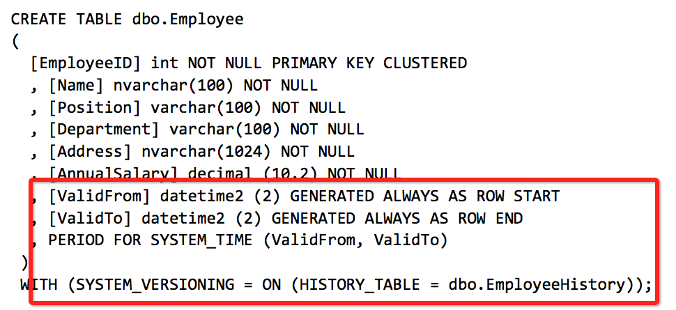

图3 SQL Server 2016

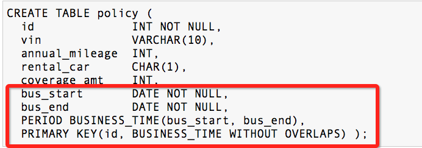

图4 IBM DB2 10

SQL Server和IBM DB2具体实现都是维护两张表，一张反映当前数据库的状态(可以称为current table)，一张记录历史上数据的变化(可以称为history table)，基本能够解决上面提到的问题。

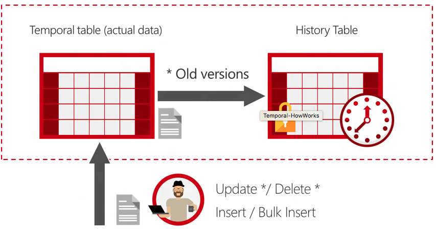

图5 Temporal特性逻辑实现

对于插入操作，可以认为是新添加的一条记录，直接保存在current table中。

更新操作是在已有的数据项上进行的，因此更新current table中相应的值，start_time改为输入的值，将原来的值放入到history table中，end_time改为输入的值。

删除操作是将current table中相应的项移动到history table中即可。

对于查询操作，如果要看当前最新的值，可以像传统的关系型数据库那样在current table上进行操作，如果要看过去各个时间段的数据，那么可以在history table上操作。

那现在的问题就在于如何高效的在history table上查询。

Partime这篇论文要解决的就是如何在history table做聚集操作比较高效。

##之前的做法

###无索引

如果不考虑索引，一种思路是每来一个查询就需要重新扫描一遍history table，逐一将记录构建成一棵“聚合树”，从根节点到叶子节点的count和代表该范围的聚集值。

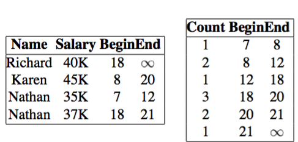

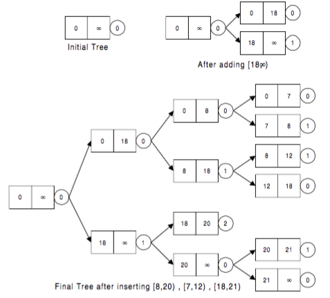

图6 聚合树

以前关于temporal aggregation的做法就是构建聚合树，当然没有做并行处理，后来人们考虑如何将改过程并行化。

算法中采用了采用了并行化的计算方法，将任务拆分成几个子任务，让子节点计算各自的聚合树，然后有一个协调者负责合并，这个方法协调者压力比较大。

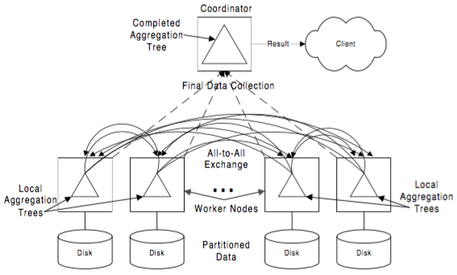

图7 聚合树并行化

在此基础之上，一种改进的方法是，让部分子节点将计算的结果两两合并，在找一个节点合并最后结果。相当于从主从架构转成了P2P架构，减轻了协调者的压力。

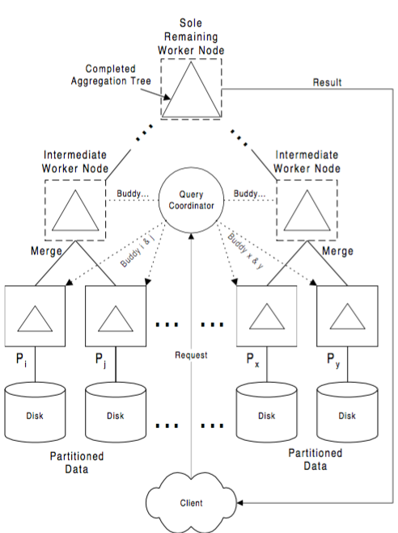

图8 聚合树并行化的改进

算法的主要问题，虽然在计算聚合树的时候可以通过数据分区，将部分数据交给一个节点并行计算，再对结果合并，但是对于单个节点而言，要计算的聚合树是不能并行化的，而且也不能保证二叉树是平衡的，最坏的情况变成一个链表的结构，构建的复杂度为O(n^2)，对于NUMA结构，如果聚合树变得很大，内存访问的效率也会降低。

###有索引

####Multi-version B-tree

在原有B-tree索引的基础上，每一个叶子节点除了保存当前数值和最新的起始时间，还指向一个块，用于记录历史信息。

####Timeline Index

主要方法建立额外的一张表，将Temporal data按照时间顺序，在表中从上到下记录整个变化的历史，借鉴了commit log这样的思想。

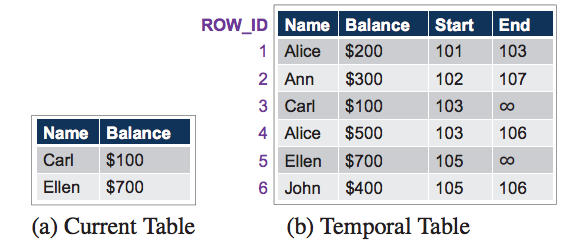

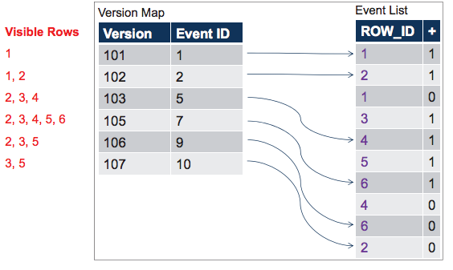

图9 Timeline Index

Timeline Index方法基于物化视图的思想，通过预处理的方式将数据重新进行组织，数据量减小了很多，而且在上面建立索引页比较方便，这样在查询的时候有了个metadata。但是不能针对更新操作比较频繁的应用场景。

##ParTime

ParTime参考了聚合树思想，但是认为树形结构不能很好的并行化，在计算每条记录的时候，互相之间应该是不相关的。ParTime同时没有采用索引的方式，对每一个查询进行一次计算。

Partime相对上面的好处有：

* 与现有的并行数据库系统很好地兼容，能够充分利用“扫描共享”的方式，虽然对每个查询需要进行一次计算，但不是每次都要将整个表扫描一遍
* 在NUMA上表象良好，充分利用了数据分区，将不同的处理器分配到不同的数据进行并行计算
* 支持多维时间，在航空业中，需要针对订机票的时间和真正航班起飞的时间进行聚合

具体思想是，将每一个数据项的start-time和end-time，可以看做在start-time时刻增加了值v，在end-time时刻减少了值v。相当于把数据项看做在两个时刻的增量。在下图中Row 0的记录可以看做是<t0, +10k>, <t7, -10k>

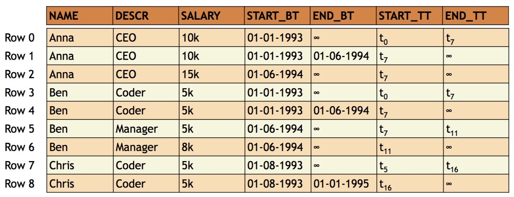

图10 ParTime

这样一来，即使是同一个记录在两个时间段的数据，通过计算增量的方法，这两个数据也不会互相影响，这样做的结果就是可以并行得到一系列<k, v>对，k代表时间戳，v代表增量，这一步的过程中还可以对相同k值的对进行合并，将<k, v1>和<k, v2>合并为<k, v1+v2>，减小计算产生的中间结果。

下一步要做的操作就是按K值进行排序，过滤掉不在查询时间范围内的k值，最后得到查询的结果。

这么一看，ParTime在设计聚合查询的时候其实借鉴了MapReduce的设计思想，可以很容易的处理大规模的数据量。

##总结

阅读ParTime这篇论文之前，我对Temporal Database还是一无所知的状态。但通过这次的论文阅读，我不光了解到Temporal Database的应用场景，在实际生活中问题的由来，还通过阅读相关文献学习了人们在解决聚集查询这个问题的探索过程。

直到最后，我发现论文提出的方法归结到了MapReduce的计算思想，很多并行计算的思想都绕不开MapReduce，现在数据库的查询也可以用MapReduce解决，很多书本上的知识已经成了历史。这方面的学习真是一个永无止境的过程。

##参考

[1]. Temporal Table in IMB DB2 10. http://www.ibm.com/developerworks/data/library/techarticle/dm-1204db2temporaldata/

[2]. Temporal Table in MS SQL Server 2016. https://msdn.microsoft.com/en-us/library/dn935015.aspx

[3]. SQL 2011 https://sigmodrecord.org/publications/sigmodRecord/1209/pdfs/07.industry.kulkarni.pdf

[4]. Gendrano, Jose Alvin G., et al. "Parallel algorithms for computing temporal aggregates." Data Engineering, 1999. Proceedings., 15th International Conference on. IEEE, 1999.

[5]. Becker, Bruno, et al. "An asymptotically optimal multiversion B-tree." The VLDB Journal—The International Journal on Very Large Data Bases 5.4 (1996): 264-275.

[6]. Kaufmann, Martin, et al. "Timeline index: A unified data structure for processing queries on temporal data in SAP HANA." Proceedings of the 2013 ACM SIGMOD International Conference on Management of Data. ACM, 2013.

[7]. Pilman, Markus, et al. "ParTime: Parallel Temporal Aggregation." Proceedings of the 2016 International Conference on Management of Data. ACM, 2016.

[8]. Non-uniform memory access(NUMA).  https://en.wikipedia.org/wiki/Non-uniform_memory_access

[9]. Dean, Jeffrey, and Sanjay Ghemawat. "MapReduce: simplified data processing on large clusters." Communications of the ACM 51.1 (2008): 107-113.